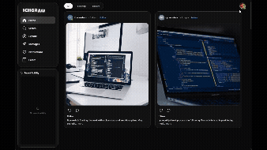
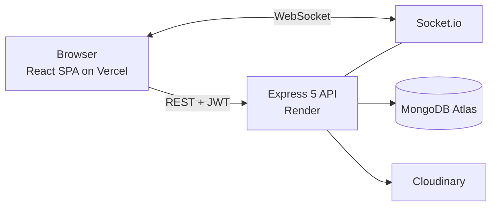

# ICHGRAM

> An Instagram-inspired social app built around one question: **how does this feel to the person using it?**
> React 19 · Vite · Express 5 · MongoDB · Socket.io


**[Live demo](https://ichgram-project.vercel.app/dashboard)** · Click **Guest login**, no sign-up needed · Or use the demo account: `itcareerhub` / `password123`

> The backend runs on a free Render instance, so the first request after idle can take ~30-50 s. That wait is a designed screen, not an accident (see below).

<p align="center">
  
</p>

_Non-commercial educational project. It started as my final project at ITCareerHub and grew over ~200 commits into something I'd actually want to use. UI is inspired by Instagram; no affiliation._

---

## The idea

The stack here is a means, not the point. I wanted every screen to be designed for **all of its states** (empty, loading, offline, deleted), every destructive action to be **forgivable**, and small details to feel intentional. Many decisions were made by asking "what would make a user feel lost, unsafe or ignored here?"

## Try it in the demo

| Do this                                                                  | What you'll see                                                                                                                                                                                                 | Why it exists                                                                                  |
| ------------------------------------------------------------------------ | --------------------------------------------------------------------------------------------------------------------------------------------------------------------------------------------------------------- | ---------------------------------------------------------------------------------------------- |
| Open the feed, switch the pill to **Following** without following anyone | "No posts from following" with a nudge towards Explore                                                                                                                                                          | An empty screen reads as broken. A hint turns it into a next step                              |
| Open the login page while the server is asleep                           | Rotating tagged hints (`PRO TIP`, `DEV FACT`, `EASTER EGG`, `HEALTH`)                                                                                                                                           | Free-tier cold start turned into a moment of personality, inspired by loading screens in games |
| Double-click / double-tap a post image                                   | A heart flies to the like button, repeated hearts don't stack the counter                                                                                                                                       | Same gesture on desktop and phone, and a first like that feels rewarded                        |
| Hover a card on **Explore**                                              | The card tilts to follow your cursor, an ambient glow in the photo's colours appears behind it with quick likes / comments, and when you hold still it keeps drifting gently, like an item dropped in Minecraft | Browsing should feel alive. On touch it becomes a press animation and a redesigned card        |
| Switch the theme                                                         | UI, the phone mockup on the login page and the favicon all switch, no reload. A refresh in dark mode never flashes white                                                                                        | Theme is applied by an inline script before first paint                                        |
| Like a post and un-like it, or send a message and delete it              | The bell counter and the Activity widget retract the notification instantly                                                                                                                                     | Users get the right to make a mistake                                                          |
| Click **Home** while scrolled down, then click it again                  | First click goes to top, second refreshes the feed. Changing the filter also jumps to top                                                                                                                       | Three ways to get back up (button, banner, sidebar) because people expect different ones       |
| Start a post, then try to close the modal                                | A warning that the draft will be lost, with a way back                                                                                                                                                          | Destructive actions shouldn't be one accidental click                                          |
| Upload a large photo and skip cropping                                   | A spinner until the image is ready, and a sensible default crop is applied                                                                                                                                      | No dead moments and no washed-out photos                                                       |
| Delete an old chat message                                               | Within 15 min it just disappears. Later, a modal explains it will show as deleted in the chat                                                                                                                   | The user is told the consequence before acting                                                 |
| Edit a post or message                                                   | An **Edited** label appears                                                                                                                                                                                     | Comments reply to a context, so the context can't change silently                              |
| Delete an account that had chats                                         | Chats keep their context and the person becomes **Deleted User** (also in Recent and search). Username and email become free again                                                                              | Nobody is left with a broken chat or a dead link                                               |

## Frontend craft

**Every state is designed.**
Empty states on the dashboard, Explore, profile and search. Skeleton loaders (including a laptop variant) and a fix for feed layout shift on slow networks. A socket banner (_Connecting to server..._) for short drops, and a `GlobalServerError` screen that listens for the browser's `online` event and recovers on its own. A separate "backend under maintenance" state so users can tell _broken_ from _loading_ from _being updated_. If a token stops being valid, the app logs the user out instead of leaving a half-rendered ghost page.

**Accessibility, clarity and motion.**
A global `prefers-reduced-motion` rule, aria attributes on icon buttons, `Escape` closes modals with a smooth exit, and a `usePreventBodyScroll` hook so the page doesn't scroll behind them. Interactive elements get a clear outline that inverts with the theme (dark on light, white on dark), so you always see where focus is and can predict what an element will do before you commit to it. On many sites an underlined label might navigate or might open a portal, and you can't tell which. Hit areas follow the same thinking: _Don't have an account? Sign up_ is one button-shaped container, so the whole row is clickable, the underline appears when you hover anywhere on it, it works with Enter / Space, and it is disabled while a login is in flight so a double click can't break the sign-in. The rule across the app: if something looks like a button and does one thing, it is a button.

**One product, two interaction models.**
Mobile isn't a shrunken desktop. There is no hover, so cards get press feedback. Messages react to double-tap. `PostPage` replaces `PostModal`. A floating top bar and bottom dock replace the sidebar. Safe-area insets and keyboard-aware inputs are handled. The principle I followed: offer more than one path to the same action (profile dropdown _and_ settings modal both have theme and logout), because people have different habits.

**Realtime UX.**
`ActivityWidget` (desktop) groups events by person and type, jumps to the exact post or chat on click, and has its own clear action that is separate from the permanent history in `NotificationsDrawer`. Typing indicators go only to the people in that chat and show a name in groups. `ActivityBadge` shows online / in-chat status with a timeout so quick glances at another chat don't flicker it. Messages render optimistically. Menus and profile cards use portals so they always sit above scroll containers. My own message colour was taken from a car interior I couldn't stop looking at.

**Consistency.**
Liking, following or commenting in `PostCard` is reflected in `PostModal` immediately. `SearchDrawer` works with a `recentlyViewed` store that picks up profiles from anywhere in the app (feed, post modal, suggestions). Deleted users drop out of Suggestions and show as **Deleted User** in Recent.

## What I tried and dropped

- **Blocking users.** I built toward it and stopped: blocking from a chat doesn't help if the other person can delete the chat and keep writing, and hiding people globally needs a dedicated "blocked users" screen so users know whom they blocked and why. Too many cases for the value, so it's parked.
- **A logo in the mobile header.** The logo is always in the desktop sidebar, so I wanted it on phones too. Static, it wasted space and added nothing. Animated (letters assembling from letters), it made me dizzy, and on a phone it sits much closer to your eyes. My plan was a header of bell, logo, search, with the filter pill sliding in over the logo once you scroll. That hit an edge case: changing the filter scrolls the page to the top, and when the new filter has no posts there is nothing to scroll, so the pill could never come back and the user was stuck. I dropped the logo. The header is now bell, filter pill, search.
- **A carousel of phone mockups on the login page.** I planned five mockups per theme instead of one: fading in and out of a blur, with dots and arrows (shown only on hover) so you could flip through them while the loading hints cycled, and an auto-advance timer that resumed after the mouse left. A toggle would show all of them regardless of theme. I dropped it. Loading was heavy even with compression, and resizing the window made the whole interface rubbery: CPU around 5%, GPU idle and cool, yet animations ran at roughly half speed and even the taskbar and window switching felt blocked until the resize queue drained. It also visually overloaded the login and register pages. I didn't want to scare users, so there are two mockups, one per theme.
- **A desktop footer.** With an effectively endless feed it only repeated what the sidebar already offers. It may return as part of the profile page once there's more to put in it.
- **A post preview on mobile.** It rendered distorted, and showing a misleading preview felt like deceiving the user, so I removed it.
- **`PostModal` was rewritten five times** (v2.0 to v2.4) before it felt right, and then got a dedicated mobile `PostPage`.

## Under the hood



| Layer             | Tech                                               | Why                                                          |
| ----------------- | -------------------------------------------------- | ------------------------------------------------------------ |
| Frontend          | React 19, Vite 8, React Router 7, CSS Modules      | Fast dev loop, scoped styles, `data-theme` design tokens     |
| UI libs           | Framer Motion, react-easy-crop, emoji-picker-react | Transitions, cropping, reactions                             |
| Backend           | Node.js (ESM), Express 5, Mongoose 9               | Small, explicit API layer                                    |
| Realtime          | Socket.io 4                                        | Rooms, presence, typing, delivery events                     |
| Media             | multer (memory), Cloudinary                        | No local disk, face-aware avatar crop, auto format / quality |
| Auth & protection | JWT, bcrypt, express-rate-limit                    | Three rate-limit tiers: global API, auth, content creation   |
| Hosting           | Vercel, Render, MongoDB Atlas                      | Free-tier cloud deployment                                   |

- **Realtime layer:** one room per user and per chat. Presence is `Map<userId, { socketIds: Set }>`, so a user with three tabs goes offline only when the last tab closes.
- **Chat model:** group admin, `leftUsers`, per-user `deletedFor` (hide a chat, it returns when someone writes), system messages, reactions, edit / delete, read receipts.
- **Sessions:** optional "remember me" (30 d vs 1 d JWT, the choice survives navigation and reloads), guest accounts bound to a device ID, 1-hour idle auto-logout synced across tabs.
- **Cold-start resilience:** the profile request waits up to 45 s for the backend to wake, with an axios retry and a global server-state event the UI reacts to.
- **Account deletion:** anonymised, related likes / comments / notifications cleaned up, Cloudinary images removed, live sockets disconnected. Seeded demo accounts can't be edited, and "deleting" one resets it.
- **Security pass after launch:** sensitive fields hidden at schema level, guest accounts blocked from password login, input types checked against NoSQL operator injection, CORS allowlist in production, `trust proxy` behind Render.

## Getting started

**Prerequisites:** Node.js 24 (what I develop on), Docker (or any MongoDB instance)

```bash
# 1. MongoDB
docker compose up -d

# 2. Backend
cd backend
cp .env.example .env      # fill in values (see below)
npm install
npm run dev               # http://localhost:3333

# 3. Frontend (new terminal)
cd frontend
cp .env.example .env
npm install
npm run dev               # http://localhost:5173
```

On first start with an empty database the server seeds 10 demo users with sample posts and a fixed follow graph (password `password123`). The best way to explore is **Guest login**.

| File            | Variable                                                               | Purpose                                                           |
| --------------- | ---------------------------------------------------------------------- | ----------------------------------------------------------------- |
| `backend/.env`  | `PORT`, `MONGO_URI`, `JWT_SECRET`                                      | Server, database, token signing                                   |
| `backend/.env`  | `CLOUDINARY_CLOUD_NAME`, `CLOUDINARY_API_KEY`, `CLOUDINARY_API_SECRET` | Image uploads                                                     |
| `backend/.env`  | `CLIENT_URL`                                                           | Allowed frontend origin in production (no trailing slash)         |
| `frontend/.env` | `VITE_API_URL`                                                         | Backend base URL **without** `/api`, e.g. `http://localhost:3333` |

## Roadmap

Product ideas on the list: replying to a specific message, a page with everything I've liked, photos in chat, editing a group's name and avatar, a filter for archived / hidden chats, and user blocking (see above).

Engineering work I'm planning:

- [ ] Pagination / infinite scroll for the feed
- [ ] Verify the JWT during the Socket.io handshake instead of trusting client-sent user data
- [ ] Automated tests (Vitest + Supertest) and a CI workflow
- [ ] httpOnly cookie sessions instead of `localStorage` tokens
- [ ] Password recovery

## How it was built

I built this with AI as a pair-programmer: Gemini for ideas, implementation approaches and optimisation throughout the project, and Claude for debugging, security review and for sharpening this README by reading the code. The product ideas, the taste, what to keep and what to cut, and the testing are mine.

## Credits

Educational portfolio project. Design inspired by Instagram; not affiliated with or endorsed by Meta.
